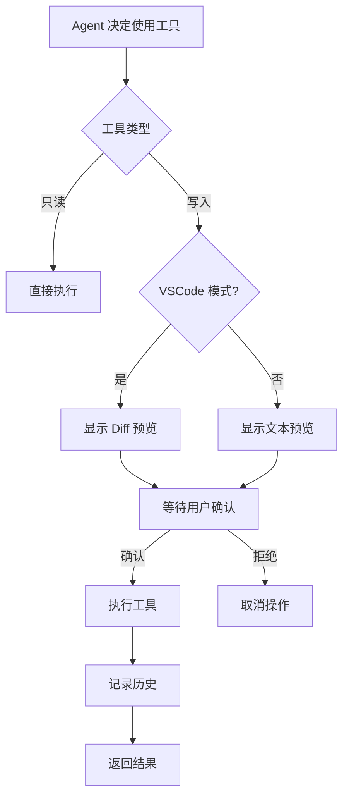

# VSCode 集成最佳实践

本文档介绍如何优雅地集成 VSCode 扩展功能，参考 Anthropic Claude Code 的设计模式。

## 1. 文件编辑联动

### 当前实现问题

`backend/tools/filesystem.py` 的 `edit_file` 直接修改文件：

```python
# ❌ 问题：直接修改文件，VSCode 不知道
def edit_file(path, old_str, new_str):
    with open(path, 'w') as f:
        f.write(new_content)
```

**缺点：**
- VSCode 不知道文件被修改
- 无法触发 undo/redo
- 没有 diff 预览
- 用户无法确认更改

### 推荐方案：先 Diff 后应用

```python
def edit_file(path: str, old_str: str, new_str: str,
              project_root: Optional[str] = None,
              show_preview: bool = True) -> Dict[str, Any]:
    """
    Edit file with VSCode integration

    在 VSCode 模式下：
    1. 先显示 diff 预览
    2. 等待用户确认（可选）
    3. 通过 VSCode API 应用更改

    在普通模式下：
    - 直接修改文件
    """
    from backend.rpc.client import is_vscode_mode
    from backend.tools import vscode

    # 读取原文件内容
    with open(path, 'r') as f:
        original_content = f.read()

    # 生成新内容
    new_content = original_content.replace(old_str, new_str)

    if is_vscode_mode():
        # VSCode 模式：使用扩展 API
        if show_preview:
            # 1. 显示 diff
            vscode.show_diff(
                title=f"Edit: {os.path.basename(path)}",
                original_path=path,
                modified_content=new_content
            )

        # 2. 通过 VSCode API 应用更改
        result = vscode.apply_changes(path, old_str, new_str)
        return result
    else:
        # 普通模式：直接修改
        with open(path, 'w') as f:
            f.write(new_content)
        return {'success': True, 'path': path}
```

### VSCode 扩展端实现

在 `vscode-extension/src/jsonRpcServer.ts` 中：

```typescript
private async handleApplyChanges(params: any): Promise<any> {
    const { path, oldStr, newStr } = params;

    // 1. 打开文件
    const document = await vscode.workspace.openTextDocument(path);
    const editor = await vscode.window.showTextDocument(document);

    // 2. 找到匹配位置
    const text = document.getText();
    const index = text.indexOf(oldStr);

    if (index === -1) {
        return {
            success: false,
            error: 'String not found in file'
        };
    }

    // 3. 应用编辑（通过 WorkspaceEdit，支持 undo/redo）
    const edit = new vscode.WorkspaceEdit();
    const startPos = document.positionAt(index);
    const endPos = document.positionAt(index + oldStr.length);
    const range = new vscode.Range(startPos, endPos);

    edit.replace(document.uri, range, newStr);

    // 4. 应用更改
    const success = await vscode.workspace.applyEdit(edit);

    if (success) {
        // 5. 高亮更改部分
        const newEndPos = document.positionAt(index + newStr.length);
        const newRange = new vscode.Range(startPos, newEndPos);
        editor.selection = new vscode.Selection(startPos, newEndPos);
        editor.revealRange(newRange, vscode.TextEditorRevealType.InCenter);

        return {
            success: true,
            message: `Applied changes to ${path}`
        };
    } else {
        return {
            success: false,
            error: 'Failed to apply edit'
        };
    }
}
```

## 2. Diff 预览实现

### TypeScript 实现

```typescript
private async handleShowDiff(params: any): Promise<any> {
    const { title, originalPath, modifiedContent } = params;

    try {
        // 1. 读取原文件
        const originalUri = vscode.Uri.file(originalPath);
        const originalDoc = await vscode.workspace.openTextDocument(originalUri);

        // 2. 创建临时文件存储修改后的内容
        const tempUri = vscode.Uri.parse(`untitled:${originalPath}.modified`);
        const modifiedDoc = await vscode.workspace.openTextDocument(tempUri);

        // 3. 写入修改内容
        const edit = new vscode.WorkspaceEdit();
        edit.insert(tempUri, new vscode.Position(0, 0), modifiedContent);
        await vscode.workspace.applyEdit(edit);

        // 4. 显示 diff
        await vscode.commands.executeCommand(
            'vscode.diff',
            originalUri,
            tempUri,
            title
        );

        return {
            success: true,
            message: `Diff shown: ${title}`
        };
    } catch (error) {
        return {
            success: false,
            error: error.message
        };
    }
}
```

## 3. Claude Code 扩展最佳实践

### 3.1 工具分类设计

参考 Claude Code 的工具设计模式：

```python
# backend/tools/categories.py

TOOL_CATEGORIES = {
    # 只读工具（无需确认）
    "readonly": [
        "view_file",
        "list_dir",
        "grep_search",
        "get_active_file",
        "get_selection"
    ],

    # 写入工具（需要预览/确认）
    "write": [
        "edit_file",
        "create_file",
        "apply_changes"
    ],

    # 执行工具（需要确认）
    "execute": [
        "bash_run",
        "cmake_build"
    ],

    # VSCode 集成（只在 VSCode 模式下可用）
    "vscode": [
        "show_diff",
        "open_file",
        "get_workspace_folder"
    ]
}
```

### 3.2 确认流程

```python
# backend/agent/confirmation.py

async def confirm_tool_execution(tool_name: str, params: dict) -> bool:
    """
    工具执行确认流程

    参考 Claude Code 的设计：
    - 写入操作：显示 diff，等待确认
    - 执行操作：显示命令，等待确认
    - 只读操作：直接执行
    """
    from backend.rpc.client import is_vscode_mode
    from backend.tools import vscode

    category = get_tool_category(tool_name)

    if category == "readonly":
        # 只读操作，直接执行
        return True

    elif category == "write" and tool_name == "edit_file":
        if is_vscode_mode():
            # VSCode 模式：显示 diff
            vscode.show_diff(
                title=f"Confirm: {tool_name}",
                original_path=params['path'],
                modified_content=generate_modified_content(params)
            )

            # 等待用户确认
            return await wait_for_user_confirmation()
        else:
            # CLI 模式：文本提示
            print(f"About to edit {params['path']}")
            print(f"Replace: {params['old_str'][:50]}...")
            print(f"With: {params['new_str'][:50]}...")
            return input("Confirm? (y/n): ").lower() == 'y'

    elif category == "execute":
        # 执行操作：显示命令
        if is_vscode_mode():
            # 使用 VSCode 确认对话框
            result = vscode.show_confirmation(
                f"Execute: {params.get('command', tool_name)}",
                detail="This will run on your system"
            )
            return result
        else:
            print(f"About to execute: {params.get('command')}")
            return input("Confirm? (y/n): ").lower() == 'y'

    return True
```

### 3.3 上下文感知工具

```python
# backend/tools/context_aware.py

def get_available_tools(mode: str = "auto") -> List[str]:
    """
    根据运行环境返回可用工具

    Claude Code 模式：
    - auto: 自动检测环境
    - vscode: VSCode 集成模式
    - cli: 纯 CLI 模式
    """
    from backend.rpc.client import is_vscode_mode

    base_tools = [
        "view_file",
        "edit_file",
        "list_dir",
        "grep_search",
        "bash_run"
    ]

    if mode == "vscode" or (mode == "auto" and is_vscode_mode()):
        # VSCode 模式：添加编辑器集成工具
        vscode_tools = [
            "get_active_file",
            "get_selection",
            "show_diff",
            "apply_changes",
            "open_file",
            "insert_at_cursor",
            "replace_selection"
        ]
        return base_tools + vscode_tools
    else:
        # CLI 模式：基础工具
        return base_tools
```

### 3.4 智能文件定位

```python
# backend/tools/smart_file.py

def smart_open_file(query: str, workspace_root: str) -> Optional[str]:
    """
    智能文件定位（Claude Code 模式）

    支持：
    - 文件名：main.cpp
    - 相对路径：src/main.cpp
    - 模糊搜索：main -> src/main.cpp
    - 函数名：connectToServer -> src/network.cpp:42
    """
    from backend.rpc.client import is_vscode_mode
    from backend.tools import vscode

    # 1. 尝试直接路径
    if os.path.exists(query):
        if is_vscode_mode():
            vscode.open_file(query)
        return query

    # 2. 尝试相对路径
    rel_path = os.path.join(workspace_root, query)
    if os.path.exists(rel_path):
        if is_vscode_mode():
            vscode.open_file(rel_path)
        return rel_path

    # 3. 模糊搜索
    matches = fuzzy_search_files(query, workspace_root)
    if len(matches) == 1:
        if is_vscode_mode():
            vscode.open_file(matches[0])
        return matches[0]
    elif len(matches) > 1:
        # 显示选择列表
        if is_vscode_mode():
            selected = vscode.show_quick_pick(
                matches,
                title=f"Multiple files match '{query}'"
            )
            if selected:
                vscode.open_file(selected)
                return selected

    # 4. 搜索符号（函数名、类名）
    symbol_locations = search_symbols(query, workspace_root)
    if symbol_locations:
        location = symbol_locations[0]
        if is_vscode_mode():
            vscode.open_file(location['path'], location['line'])
        return location['path']

    return None
```

## 4. 增量编辑（Streaming Edits）

Claude Code 支持流式编辑，实时显示 LLM 生成的代码：

```typescript
// vscode-extension/src/streamingEdit.ts

export class StreamingEditProvider {
    private decorationType: vscode.TextEditorDecorationType;

    constructor() {
        // 创建装饰器类型（用于高亮正在生成的代码）
        this.decorationType = vscode.window.createTextEditorDecorationType({
            backgroundColor: new vscode.ThemeColor('editor.findMatchBackground'),
            borderRadius: '2px'
        });
    }

    async startStreamingEdit(
        editor: vscode.TextEditor,
        range: vscode.Range,
        stream: AsyncIterable<string>
    ) {
        let currentText = '';

        for await (const chunk of stream) {
            currentText += chunk;

            // 实时更新编辑器
            await editor.edit(editBuilder => {
                editBuilder.replace(range, currentText);
            }, {
                undoStopBefore: false,
                undoStopAfter: false
            });

            // 高亮新增部分
            const newRange = new vscode.Range(
                range.start,
                editor.document.positionAt(
                    editor.document.offsetAt(range.start) + currentText.length
                )
            );
            editor.setDecorations(this.decorationType, [newRange]);

            // 滚动到可见区域
            editor.revealRange(newRange, vscode.TextEditorRevealType.InCenterIfOutsideViewport);
        }

        // 清除高亮
        editor.setDecorations(this.decorationType, []);
    }
}
```

## 5. 工具使用统计

```python
# backend/telemetry/tool_usage.py

class ToolUsageTracker:
    """追踪工具使用情况（Claude Code 模式）"""

    def __init__(self):
        self.usage_stats = {
            'total_calls': 0,
            'by_tool': {},
            'by_mode': {'vscode': 0, 'cli': 0},
            'confirmations': {'accepted': 0, 'rejected': 0}
        }

    def record_tool_call(self, tool_name: str, mode: str, confirmed: bool = True):
        """记录工具调用"""
        self.usage_stats['total_calls'] += 1
        self.usage_stats['by_tool'][tool_name] = \
            self.usage_stats['by_tool'].get(tool_name, 0) + 1
        self.usage_stats['by_mode'][mode] += 1

        if confirmed:
            self.usage_stats['confirmations']['accepted'] += 1
        else:
            self.usage_stats['confirmations']['rejected'] += 1

    def get_most_used_tools(self, top_n: int = 5):
        """获取最常用的工具"""
        return sorted(
            self.usage_stats['by_tool'].items(),
            key=lambda x: x[1],
            reverse=True
        )[:top_n]
```

## 6. 错误处理和回滚

```python
# backend/tools/safe_edit.py

class SafeEditManager:
    """安全编辑管理器（支持回滚）"""

    def __init__(self):
        self.edit_history = []
        self.max_history = 50

    def create_checkpoint(self, path: str) -> str:
        """创建文件检查点"""
        with open(path, 'r') as f:
            content = f.read()

        checkpoint = {
            'path': path,
            'content': content,
            'timestamp': time.time()
        }

        self.edit_history.append(checkpoint)
        if len(self.edit_history) > self.max_history:
            self.edit_history.pop(0)

        return f"checkpoint_{len(self.edit_history)}"

    def rollback(self, checkpoint_id: str = None):
        """回滚到检查点"""
        if checkpoint_id:
            # 回滚到指定检查点
            idx = int(checkpoint_id.split('_')[1]) - 1
            checkpoint = self.edit_history[idx]
        else:
            # 回滚到最近的检查点
            checkpoint = self.edit_history[-1]

        # 恢复文件
        with open(checkpoint['path'], 'w') as f:
            f.write(checkpoint['content'])

        return {'success': True, 'restored': checkpoint['path']}
```

## 7. 推荐的工具使用流程



## 8. 完整示例：智能重构

```python
# backend/tools/refactor.py

async def intelligent_refactor(
    file_path: str,
    old_code: str,
    new_code: str,
    reason: str
) -> Dict[str, Any]:
    """
    智能重构流程（Claude Code 模式）

    1. 显示 diff
    2. 解释原因
    3. 等待确认
    4. 应用更改
    5. 运行测试
    6. 如果失败，提供回滚选项
    """
    from backend.rpc.client import is_vscode_mode
    from backend.tools import vscode

    # 1. 创建检查点
    safe_edit = SafeEditManager()
    checkpoint = safe_edit.create_checkpoint(file_path)

    try:
        # 2. 显示 diff 和原因
        if is_vscode_mode():
            # 生成新内容
            with open(file_path, 'r') as f:
                original = f.read()
            modified = original.replace(old_code, new_code)

            # 显示 diff
            vscode.show_diff(
                title=f"Refactor: {reason}",
                original_path=file_path,
                modified_content=modified
            )

            # 显示信息消息
            confirmed = await vscode.show_confirmation(
                f"Refactor: {reason}",
                detail=f"This will modify {os.path.basename(file_path)}",
                actions=["Apply", "Cancel"]
            )
        else:
            print(f"\n重构建议: {reason}")
            print(f"文件: {file_path}")
            print(f"\n原代码:\n{old_code}\n")
            print(f"新代码:\n{new_code}\n")
            confirmed = input("应用更改? (y/n): ").lower() == 'y'

        if not confirmed:
            return {'success': False, 'message': 'User cancelled'}

        # 3. 应用更改
        if is_vscode_mode():
            result = vscode.apply_changes(file_path, old_code, new_code)
        else:
            result = edit_file(file_path, old_code, new_code)

        if not result['success']:
            return result

        # 4. 运行测试（可选）
        test_result = await run_related_tests(file_path)

        if test_result['failed'] > 0:
            # 测试失败，询问是否回滚
            if is_vscode_mode():
                rollback_choice = await vscode.show_warning(
                    f"Tests failed: {test_result['failed']} failures",
                    actions=["Rollback", "Keep Changes"]
                )
            else:
                print(f"\n⚠️  测试失败: {test_result['failed']} 个")
                rollback_choice = input("回滚更改? (y/n): ").lower()

            if rollback_choice in ['Rollback', 'y']:
                safe_edit.rollback(checkpoint)
                return {
                    'success': False,
                    'message': 'Rolled back due to test failures',
                    'test_result': test_result
                }

        return {
            'success': True,
            'message': f'Refactored {file_path}',
            'test_result': test_result
        }

    except Exception as e:
        # 发生错误，自动回滚
        safe_edit.rollback(checkpoint)
        return {
            'success': False,
            'error': str(e),
            'rolled_back': True
        }
```

## 9. 配置最佳实践

```json
// .vscode/settings.json
{
  "claude-qwen.autoStart": false,  // 不自动启动，按需启动
  "claude-qwen.confirmEdits": true,  // 始终确认编辑
  "claude-qwen.showDiffPreview": true,  // 显示 diff 预览
  "claude-qwen.enableTelemetry": true,  // 启用使用统计
  "claude-qwen.maxHistorySize": 50,  // 最大历史记录
  "claude-qwen.logLevel": "info"
}
```

## 10. 总结

**核心原则：**

1. ✅ **预览优先** - 所有写入操作都应该先显示 diff
2. ✅ **用户控制** - 重要操作需要明确确认
3. ✅ **可回滚** - 保留编辑历史，支持撤销
4. ✅ **上下文感知** - 根据环境（VSCode/CLI）调整行为
5. ✅ **渐进增强** - CLI 模式也能工作，VSCode 模式体验更好

**参考资源：**
- [Claude Code 文档](https://docs.anthropic.com/claude/docs/claude-code)
- [VSCode Extension API](https://code.visualstudio.com/api)
- [Language Server Protocol](https://microsoft.github.io/language-server-protocol/)
